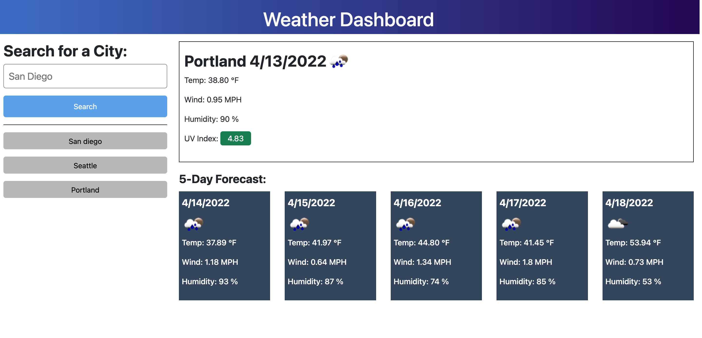

# HMWK6 - (06 Server-Side APIs: Weather Dashboard)

## Description

This is a weather dashboard that runs in the browser and features dynamically updated HTML and CSS. I utilized Moment.js in working with local storage in determining if a new API request was necessary. This web app also has a clean and polished, responsive user interface that adapts to multiple screen sizes.

## Mock-Up

The following image shows the web application's appearance:

## Link

[Live site](https://brianbixby.github.io/hmwk6/)

## Technology

- [HTML](https://developer.mozilla.org/en-US/docs/Web/HTML)
- [CSS](https://developer.mozilla.org/en-US/docs/Web/CSS)
- [Github](https://github.com/brianbixby/hmwk6)
- [Javascript](https://developer.mozilla.org/en-US/docs/Web/javascript)
- [Local Storage](https://developer.mozilla.org/en-US/docs/Web/API/Window/localStorage)
- [Moment.js](https://momentjs.com/)
- [OpenWeather One Call API](https://openweathermap.org/api/one-call-api)
- [Fetch](https://developer.mozilla.org/en-US/docs/Web/API/Fetch_API)
- [Bootstrap](https://getbootstrap.com/)
